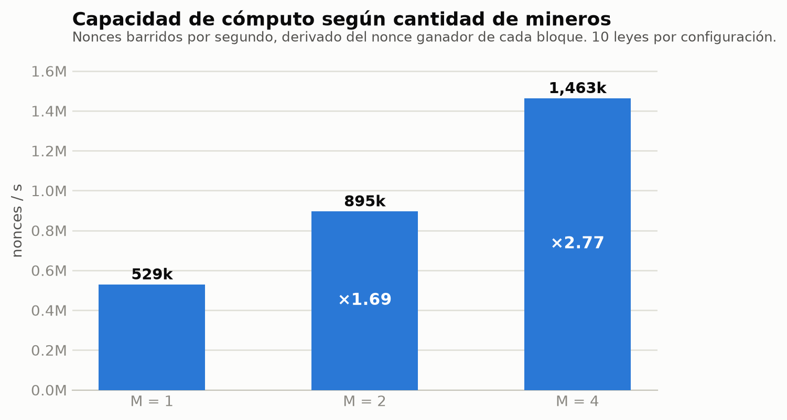
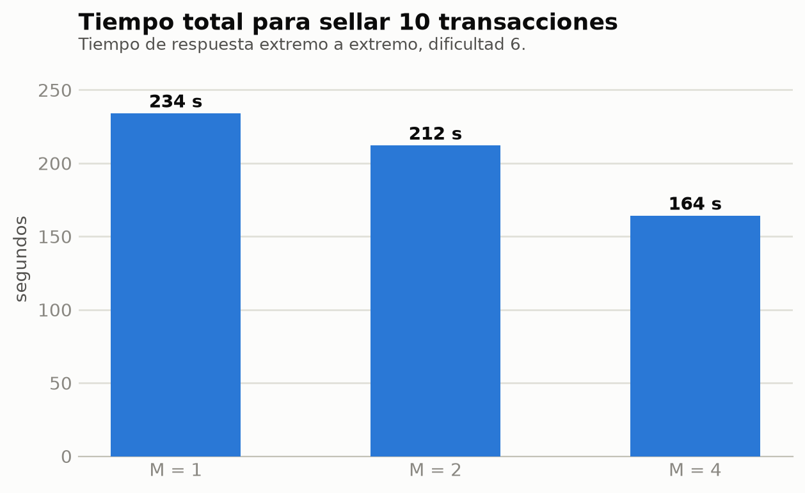
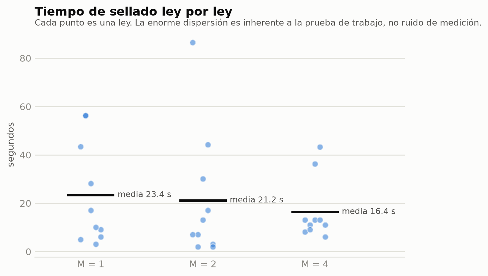
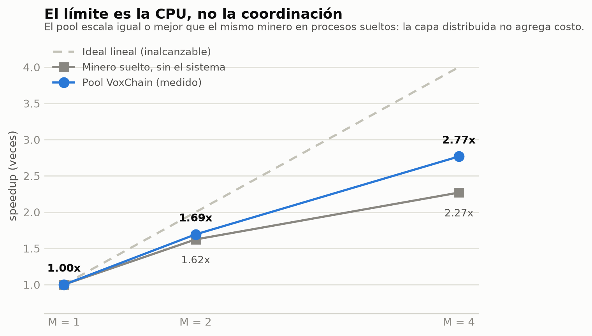
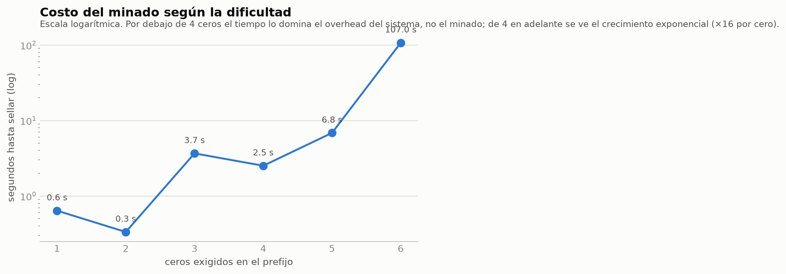
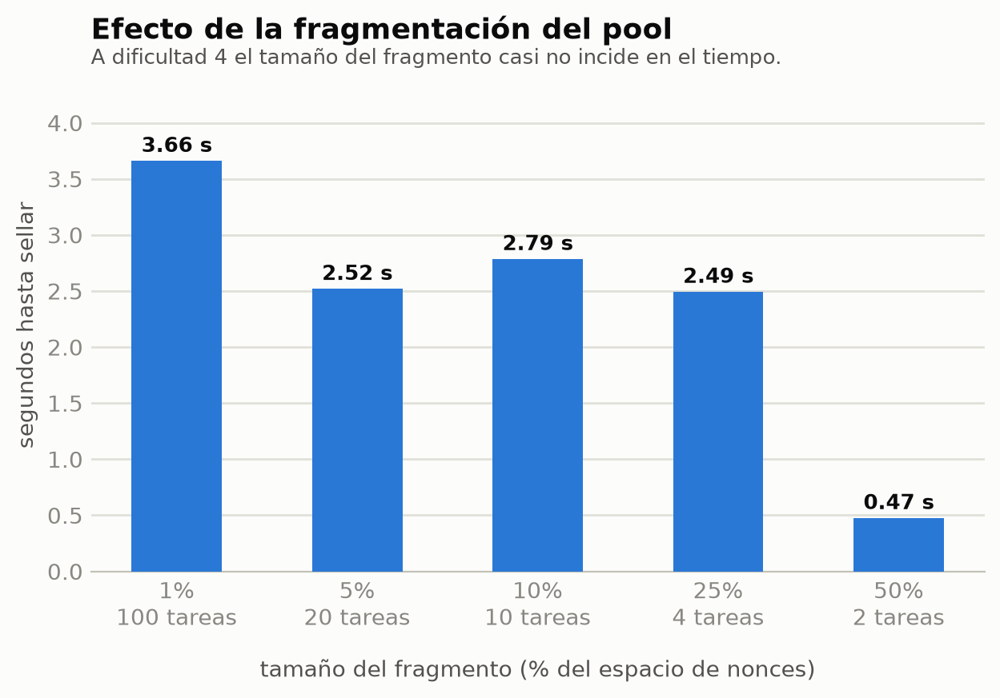
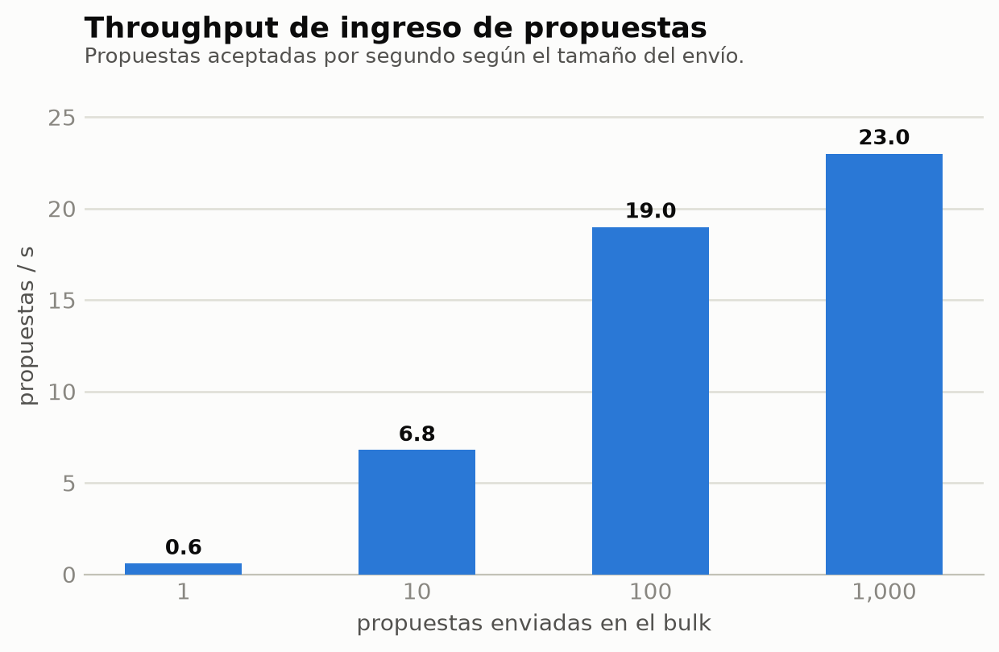

# Informe final — VoxChain Reborn

**Trabajo Final Integrador — Sistemas Distribuidos y Programación Paralela**
Universidad Nacional de Luján

> Documento correspondiente a la sección 7 de la checklist. Cubre la comparativa
> y el análisis de resultados, el diagrama de arquitectura, la explicación del
> pool de transacciones y su escalado, los gráficos comparativos y la reflexión
> crítica. Se apoya en los otros documentos de `docs/informe/` y en los README
> de cada pilar.

---

## Resumen ejecutivo

VoxChain Reborn es una blockchain de **gobierno por consenso de esfuerzo
computacional**: no transfiere dinero, sino que promulga y deroga *leyes*. Una
propuesta se sella en la cadena cuando alguien de la red encuentra un nonce que
satisface una prueba de trabajo sobre el contenido de esa ley.

El sistema se implementó en tres pilares — el minero (CPU y GPU), la
infraestructura distribuida de servicios, y el despliegue sobre Kubernetes en
dos clústers federados — y se validó con una batería de pruebas de carga que
varía las cuatro dimensiones que pide la consigna: volumen de transacciones,
dificultad, fragmentación del pool y **cantidad de recursos**.

El resultado principal: **el pool de minado escala 2,77x al cuadruplicar los
mineros**, que es igual o mejor que el propio techo del hardware sobre el que se
midió. La capa distribuida no le cuesta velocidad al sistema; el límite es la
CPU disponible.

En la etapa final se agregaron reglas de gobierno sobre la red de minado —
categorías de ley con agenda por equipo, deliberación previa a cada ventana,
quórum de mineros para abrirla, restricción de quién propone y dificultad
dinámica sobre el cómputo vivo—, resumidas en la sección 1.3.

---

## 1. El sistema

### 1.1 El dominio

Proponer una ley queda reservado a quien responde por cómputo en la red: el
fundador de un equipo o el dueño de un minero standalone (sección 1.3). El Nodo
Coordinador de Transacciones (NCT) abre una **ventana de votación** por cada
propuesta, y la red compite por resolver:

```
partial_hash_base = law_id + text_hash + voting_window_id + action
nonce válido  ⇔  md5(partial_hash_base + str(nonce))  empieza con n ceros
```

La dificultad es `n` ceros para promulgar y `n+1` para derogar. Esa relación es
**invariante**: derogar cuesta siempre más que promulgar, y eso es una decisión
de gobierno, no un parámetro de red. Lo que sí se mueve es `n`: en el
despliegue (`DYNAMIC_DIFFICULTY=true`) el NCT lo recalcula para cada ley según
el **cómputo vivo** de la red, de modo que promulgar cueste siempre alrededor de
`DIFFICULTY_TARGET_SECONDS`. El diseño original lo fijaba por configuración y
prohibía cualquier ajuste autónomo; por qué se cambió de opinión, y por qué este
ajuste no es manipulable como el que se había descartado, está en la sección
7.1.bis. Con `DYNAMIC_DIFFICULTY=false` el sistema vuelve al `n` fijo.

El NCT **no arbitra contenido**: sólo coordina ventanas. Quién gana lo decide el
esfuerzo computacional.

### 1.2 Identidad y firma

Cada nodo tiene par de claves. Las propuestas viajan firmadas y con
`author_pubkey`; **las claves privadas nunca se persisten ni viajan por
RabbitMQ**. La clave del ciudadano vive en el navegador como `CryptoKey` **no
extraíble** en IndexedDB: la aplicación puede pedirle firmas, pero no leer el
material de la clave. La verificación de firma es configurable
(`REQUIRE_SIGNATURES`) para permitir una migración gradual: en modo permisivo
acepta propuestas sin firma pero **rechaza las que traen una firma inválida**.
El despliegue actual corre en modo permisivo (`REQUIRE_SIGNATURES=false` en
`voxchain-config.yaml`).

Implementación: `pilar2-distribuido/worker/worker_pkg/identity.py` y
`common/identity/signing.py`, con cobertura en `test_signatures.py` y
`test_signing.py`.

### 1.3 Reglas de gobierno de la etapa final

Sobre el consenso básico se agregaron cinco reglas. La fuente normativa es
`AGENT.md` §3; acá va el resumen de qué resuelve cada una.

| Regla | Qué hace | Por qué |
|---|---|---|
| **Categorías y agenda** (AGENT.md 3.10) | Toda ley pertenece a un área (`economia`, `salud`, …, `general` por defecto), firmada por el autor y heredada por su derogación. Cada equipo declara la agenda de áreas a las que aporta cómputo; ante una ley de otra área su coordinador no fragmenta el espacio. | Un pool pasa a ser una facción con agenda propia, no infraestructura que mina todo lo que pasa. La categoría **no** entra en `partial_hash_base`, así que el minero de Pilar 1 no cambia. |
| **Quórum de mineros** (3.11) | El NCT no abre la ventana si no hay mineros **vivos** que tomarían esa ley (aplicando agenda y vetos). La ley queda en la cola, que no se bloquea: el turno pasa a la siguiente. El veredicto se publica en `nct:availability` y el API lo expone en `GET /api/system/availability`. | Antes una ley con la red vacía vencía, se descartaba y su reproposición pagaba el cooldown largo, por una falla ajena al autor. Si la red cae **durante** la ventana, al vencer la ley vuelve a la cola (`expired_no_quorum`). |
| **Deliberación** (3.12) | Antes de abrir la ventana el NCT **anuncia** la ley y abre una pausa (`DELIBERATION_SECONDS`, 120 s) para que cada equipo o standalone convocado responda, firmado, si aporta cómputo. Sólo minan los que aceptaron (`participants` en el desafío). Dificultad y plazo se congelan al anunciar, sobre el convocado más grande. | El PoW sólo contaba a favor; esto le da peso al "no". Si nadie acepta y alguien veta, la ley se descarta; si nadie responde, vuelve a la cola (con un tope de `MAX_SILENT_DELIBERATIONS`). |
| **Quién propone** (3.2) | Sólo el fundador de un equipo o el dueño de un minero standalone (`RESTRICT_PROPOSERS=true`); se verifica en el API (403) y en el NCT. | Trae la ley quien después decide si la mina, y un equipo tiene una sola voz para proponer. No cierra Sybil. |
| **Dificultad dinámica** (11.3) | `n` se recalcula sobre el cómputo vivo; sube en el acto y baja con histéresis, con un trinquete por área persistido en Redis. `NONCE_SPACE` se deriva de `n` y viaja en el desafío. | Sostener constante el tiempo de promulgación ante una población que cambia. Detalle en 7.1.bis. |

Las pruebas de carga de la sección 4 son anteriores a estas reglas o corren con
ellas apagadas: el experimento de escalado usa `DELIBERATION_SECONDS=0` y
`RESTRICT_PROPOSERS=false` porque mide capacidad de cómputo, no decisiones.

---

## 2. Arquitectura

### 2.1 Vista general

```
   ciudadano/nodo                          ┌──────────────────────────────┐
   (author_pubkey)                         │            Redis             │
        │  POST /api/laws                  │  law:* window:* block:*      │
        ▼                                  │  chain  active_window        │
 ┌───────────────┐                         │  cooldown:*  leader lease    │
 │ voxchain-api  │                         └──────────────▲───────────────┘
 │   (FastAPI)   │                                        │ estado + sellado
 └───────┬───────┘                                        │
         │ propuestas (cola)                              │
         ▼                                                │
 ┌───────────────┐                         ┌──────────────┴───────────────┐
 │   RabbitMQ    │   desafio_activo        │       NCT primary            │
 │               │   (exchange topic)      │  - cola round-robin + cuota  │
 │  colas +      │────────────────┐        │  - abre/cierra ventana       │
 │  exchanges    │                │        │  - verifica nonce, sella     │
 │               │◄───────────────┼────────│  - publica heartbeats        │
 └───────┬───────┘ respuesta_nonce│        └──────────────────────────────┘
         │           (cola)       │                       ▲
         │                        │                       │ nct.heartbeat
         │                        ▼        ┌──────────────┴───────────────┐
         │           ┌────────────────────┐│       NCT standby            │
         │           │  Pool Coordinator  ││  - monitorea heartbeats      │
         │           │  - fragmenta el    ││  - toma el lease si el       │
         │           │    espacio de      ││    líder calla               │
         │           │    nonces          │└──────────────────────────────┘
         │           │  - reparte tareas  │
         │           │  - auto-mina       │
         │           └─────────┬──────────┘
         │             HTTP    │  ▲ registro + heartbeat
         │           /work/next│  │
         │                     ▼  │
         │           ┌────────────────────┐   invoca el minero de Pilar 1
         └──────────►│   pool-workers     │──► GPU (CUDA)
             nonce   │   (N réplicas)     │    └ fallback automático a CPU
            ganador  └────────────────────┘
```

### 2.2 Despliegue: dos clústers federados

```
GCP — GKE (clúster 1)                      Clúster GPU — k3s (clúster 2)
┌──────────────────────────────┐           ┌──────────────────────────────┐
│ Namespace: voxchain          │           │ Namespace: g-git-push-cv     │
│                              │   AMQPS   │                              │
│ RabbitMQ (STS) ─── LB:5671 ──┼──────────►┼ workers standalone           │
│                              │(CA propia)│  + un pool: coordinator      │
│ Redis + Sentinel (STS)       │           │    y 3 mineros               │
│        └──────── LB:6379 ────┼──────────►┼ estado worker:status:*       │
│                              │  (sin TLS)│ - CPU por defecto            │
│ NCT primary + standby        │           │ - GPU opt-in por pod         │
│ voxchain-api  :8000          │           │ - CA de RabbitMQ montada     │
│ voxchain-frontend (Ingress)  │           │                              │
│ Prometheus + Grafana         │           │                              │
└──────────────────────────────┘           └──────────────────────────────┘
```

La federación es la parte interesante del despliegue: los workers viven en un
clúster **ajeno** (el del profesor), fuera de la VPC, y se conectan al broker de
GKE por internet vía **AMQPS con una CA propia**. Eso obligó a exponer RabbitMQ
por LoadBalancer con TLS y a resolver el problema de que el certificado tiene
SANs DNS mientras los workers se conectan por IP — se resolvió con un override
de SNI (`ssl_server_hostname` en `common/messaging/rabbitmq.py`).

Los workers también escriben su estado (`worker:status:*`, con TTL) en Redis,
que es lo único que comparten los dos clústers. Por eso Redis tiene su propio
LoadBalancer (`redis-external`). Ese canal va autenticado con contraseña pero
**sin TLS**, y es la principal deuda de seguridad del despliegue (sección 7.1).
Desde septiembre está acotado a la IP de salida del k3s
(`loadBalancerSourceRanges`, sección 6.2).

Los workers usan la imagen `worker-gpu`, que trae el minero CUDA compilado para
`sm_61`, la arquitectura de la GTX 1060 del clúster k3s. La GPU es **opt-in por
pod**: los manifests piden `nvidia.com/gpu` sólo si se descomenta el recurso
junto con las variables `NVIDIA_*`. Sin eso, el minero detecta que no hay GPU
utilizable (self-test del binario) y mina con CPU, que es como corren hoy los
manifests del repositorio.

### 2.3 Componentes

| Componente | Rol |
|---|---|
| `nct-coordinator/` | NCT: cola round-robin por autor con cuota de turnos, cooldown, apertura/cierre de ventana, verificación de nonce, sellado del bloque, heartbeats |
| `worker/` (modo `pool-coordinator`) | Coordinador de un **equipo**: fragmenta el espacio de nonces, reparte tareas por HTTP, auto-mina, arbitra el ganador y aplica la agenda del equipo |
| `worker/` (modo `pool-worker`) | Miembro de un equipo: pide rangos al coordinator y los mina |
| `worker/` (modo `pool-auto`) | Pool de infraestructura anónimo: los pares eligen coordinator por mini-PoW |
| `worker/` (modo `standalone`) | Mina el espacio completo por su cuenta (modo competitivo) |
| `voxchain_api/` | API REST (FastAPI): propuestas, cadena, estado de workers, equipos, deliberación y disponibilidad (quórum) |
| `voxchain-frontend/` | SPA en Angular; firma las propuestas y las decisiones de deliberación en el navegador |
| `common/` | Paquete compartido: `blockchain` (bloques, desafío, dificultad, categorías, quórum, deliberación, proponentes), `identity` (firmas), `storage` (Redis), `messaging` (RabbitMQ), health, logging, métricas |

> **Nota sobre el `transaction-pool/`**: el diseño original tenía un servicio
> separado (TrP). Terminó absorbido por el worker en modo `pool-coordinator`, que
> cumple la misma función (fragmentar y repartir) sin un despliegue adicional.
> Las colas `tareas_trp` y `keepalive_trp` todavía se declaran por
> compatibilidad, pero nada consume de ellas.

### 2.4 Flujos de mensajería

**Tres flujos canónicos hacia/desde el NCT:**

| # | Nombre | Tipo | Dirección | Contenido |
|---|---|---|---|---|
| 1 | `propuestas` | cola | nodo → NCT | `law_id, author_pubkey, text_hash, created_at, action, category` |
| 2 | `desafio_activo` | exchange topic | NCT → red | `voting_window_id, law_id, n_zeros_required, deadline, partial_hash_base, action, category, nonce_space, participants` |
| 3 | `respuesta_nonce` | cola | red → NCT | `voting_window_id, nonce, winning_node_or_pool, block_hash_candidato` |

La **deliberación** no agrega un flujo de RabbitMQ: el anuncio vive en Redis
(`nct:deliberation`, sólo la ley y su área) y las respuestas llegan firmadas por
el API. `partial_hash_base` recién se publica al abrir la ventana, para que
nadie pueda empezar a minar durante la pausa.

**Failover del NCT y coordinación:**

| # | Nombre | Tipo | Dirección | Contenido |
|---|---|---|---|---|
| 4 | `nct.heartbeat` | exchange topic | líder → standbys | `nct_id, ts, active_window_id, last_block_hash` |
| 5 | `pool.election` | exchange topic | pares ↔ pares | claims y heartbeats del mini-PoW del pool de infraestructura |
| 6 | `worker.command` | exchange topic | backend → worker | `switch_mode`, `stop` (alta y baja de equipos) |

**Distribución interna de trabajo:** el coordinator reparte fragmentos por
**HTTP** (`GET /work/next/<miner_id>`), no por cola, porque necesita saber qué
minero tiene cada rango para reasignarlo si desaparece.

---

## 3. El pool de transacciones: cómo funciona y cómo escala

Esta sección responde el pedido explícito de la consigna: *"explicar cómo
funciona el pool de transacciones y cómo escala con diversas cargas y workers"*.

### 3.1 Dos modos de minado, dos comportamientos distintos

El sistema soporta minado **competitivo** y **cooperativo**, y no escalan igual.
Entender la diferencia es lo que hace interpretable todo el resto del informe.

| Modo | Reparto del trabajo | Efecto de duplicar mineros |
|---|---|---|
| **Standalone (competitivo)** | Cada worker mina el rango completo `[0, nonce_space)`, solo, sobre la misma base | **Ninguno en velocidad.** Todos hacen el mismo cálculo y encuentran el mismo nonce |
| **Pool (cooperativo)** | El coordinator parte el espacio en fragmentos y los reparte | El trabajo se divide: el tiempo baja |

En standalone los N workers arrancan en el nonce 0, con la misma
`partial_hash_base`, y avanzan en el mismo orden. Es minado **redundante**. Eso
no es un defecto: es el modelo de Bitcoin, y compra tolerancia a fallos y
resistencia a que un nodo mienta. Pero **no compra velocidad**, y cualquier
medición de escalado hecha sobre el modo standalone daría una línea plana por
razones de diseño, no de implementación.

Por eso todas las pruebas de escalado de la sección 4 corren en **modo pool**.

### 3.2 Fragmentación del espacio de nonces

Cuando llega un desafío, el coordinator parte `[0, NONCE_SPACE)` en trozos de
`FRAGMENT_SIZE` y los encola. Cada minero registrado pide un trozo, lo barre, y
si no encuentra nada pide el siguiente. El primero que encuentra un nonce válido
lo envía al coordinator, que lo publica al NCT.

Dos parámetros gobiernan el comportamiento:

- **`NONCE_SPACE`** debe ser holgadamente mayor que el trabajo esperado
  (`16^n` para `n` ceros), o la ventana puede agotarse sin solución.
- **`FRAGMENT_SIZE`** es el grano del reparto. Fragmentos chicos reparten mejor
  la carga pero pagan más ida y vuelta HTTP; fragmentos grandes son eficientes
  pero desbalancean cuando hay muchos mineros.

### 3.3 Quién coordina el pool

Hay dos topologías de pool, y en cada una el coordinator se decide distinto
(AGENT.md 4.2):

- **Equipo con dueño** (`pool-coordinator` / `pool-worker`): una persona funda
  el equipo y **designa** cuál de sus mineros coordina. La elección por lease en
  Redis no elige *quién* manda, sino que garantiza que haya exactamente un
  coordinador vivo si el pod se reinicia.
- **Pool de infraestructura** (`pool-auto`): nodos anónimos e intercambiables,
  sin nadie a quien designar. Ahí el rol se decide con una **mini prueba de
  trabajo** entre los candidatos (`POOL_ELECTION_N_ZEROS`, por defecto 2
  ceros), arbitrada por el exchange `pool.election`: quien resuelve primero
  coordina y el resto verifica su solución y se le une como minero. Es
  coherente con el resto del sistema — el mismo criterio que decide quién sella
  una ley decide quién coordina — y es barato (256 intentos en promedio).

Cuando hay Redis, los dos mecanismos se disputan el mismo lease
`pool:leader:<pool_id>`, así que no pueden quedar dos coordinadores activos
sobre el mismo pool.

El coordinator **además mina**: consume fragmentos de la misma cola que reparte.
Esto importa para leer los resultados (sección 4.2).

### 3.4 Cómo se conoce la capacidad disponible

Los mineros mandan keep-alive con `capacity` y `has_gpu`. El coordinator
mantiene el registro con TTL y purga a los que dejan de reportar
(`_purge_stale_miners`), exponiendo `voxchain_pool_miners_registered`. Así el
sistema sabe en todo momento con cuánta capacidad cuenta.

A nivel de red, cada worker publica además `worker:status:<id>` en Redis con
TTL de 15 s, incluyendo `has_gpu` y el hashrate medido. De ese registro de
cómputo **vivo** (no registrado) leen el quórum de mineros, para decidir si se
abre la ventana, y la dificultad dinámica, para elegir `n`. Si se van las GPU,
la red medida cae y `n` baja (con histéresis): es el mecanismo de **reducción
del prefijo ante ausencia de GPUs**.

---

## 4. Pruebas del sistema y análisis de resultados

### 4.1 Metodología

Se corrieron cuatro baterías, cubriendo las dimensiones de la consigna:

| Batería | Variable | Rango probado |
|---|---|---|
| Bulk | volumen de propuestas | 1 → 1.000 |
| Dificultad | ceros del prefijo | 1 → 6 |
| Fragmentación | tamaño del fragmento | 1% → 50% del espacio |
| **Recursos** | **cantidad de mineros** | **1, 2, 4** |

Las tres primeras se corrieron en julio contra el **despliegue real** (GKE +
workers en el k3s). La cuarta se corrió en local, de forma controlada; la
justificación está en 4.6.

**Entorno de la batería de recursos:** notebook con Intel i5-10210U (4 núcleos
físicos, 8 hilos), 16 GB RAM, cada minero limitado a 1 CPU vía `cpus: 1.0` en
Docker Compose. Ese límite es necesario: sin él, "el doble de mineros" serían el
doble de procesos peleándose por los mismos 4 núcleos, y el resultado mediría
saturación de la máquina en lugar del diseño del sistema.

Cada configuración levanta el stack **desde cero** (`docker compose down -v`)
para que la cadena y la cola de la corrida anterior no contaminen la siguiente,
y espera a que todos los mineros estén registrados antes de arrancar el
cronómetro.

### 4.2 N transacciones con M vs 2xM recursos

Se midieron 10 leyes por configuración, con dificultad 6.

**M cuenta al coordinator**, porque además de repartir fragmentos también mina.
Es decir: M=2 es coordinator + 1 pool-worker; M=4 es coordinator + 3.



| Mineros | Capacidad | Speedup | Tiempo total (10 leyes) |
|---|---|---|---|
| 1 | 528.651 nonces/s | 1,00x | 234,1 s |
| 2 | 895.203 nonces/s | **1,69x** | 212,1 s |
| 4 | 1.463.233 nonces/s | **2,77x** | 164,2 s |



### 4.3 Por qué medimos trabajo y no tiempo

El tiempo de sellado de una ley **no sirve para comparar configuraciones**, y
vale la pena explicar por qué porque es un resultado en sí mismo.

Minar es buscar a ciegas hasta que un nonce da un hash con el prefijo pedido.
*Dónde aparece el primero es azar*, con distribución exponencial: el desvío es
tan grande como la media. Una ley puede resolverse en el nonce 1 millón y la
siguiente en el 47 millones.



Con 10 leyes por configuración, el error estándar de la media ronda el 30% — del
mismo orden que el efecto que se quiere medir. Comparar medias de tiempo sería
comparar suerte.

La solución fue medir **cuánto trabajo se hizo**, no cuánto se tardó. El bloque
sellado guarda el nonce ganador, y como los mineros barren el espacio desde 0,
ese nonce *es* la cantidad de nonces que hubo que probar. Sumándolos y
dividiendo por el tiempo total sale la capacidad efectiva del pool en
nonces/segundo — una medida que casi no tiene varianza, porque el azar se
cancela al dividir.

> **Es un dato gratis**: no requirió instrumentar nada nuevo. El nonce ya venía
> en la respuesta de `GET /api/chain`.

### 4.4 ¿2,77x con 4x los recursos es un buen resultado?

Para responderlo hay que saber cuánto puede dar la máquina. Se midió aparte el
**mismo minero corriendo en procesos sueltos**, sin nada del sistema distribuido
(`load-tests/scenarios/bench_hardware.py`, mediana de 3 repeticiones):



| Mineros | Pool VoxChain | Minero suelto | Ideal lineal |
|---|---|---|---|
| 2 | **1,69x** | 1,62x | 2x |
| 4 | **2,77x** | 2,27x | 4x |

**El pool escala igual o mejor que el minero corriendo solo.** Toda la
maquinaria distribuida — fragmentar, repartir por HTTP, RabbitMQ, sellar en
Redis — no le cuesta velocidad de forma medible.

Lo que falta para llegar a 4x es el procesador, no el diseño: el i5-10210U es un
chip de 15 W con 4 núcleos físicos que baja de ~4,2 GHz con un núcleo activo a
~2,6 GHz con los cuatro cargados. Ni siquiera el minero suelto llega a 3x.

> Que el pool dé *más* que el minero suelto parece imposible. La explicación es
> que el benchmark crudo mantiene los 4 procesos al 100% en simultáneo — el peor
> caso térmico posible — mientras que los mineros del sistema tienen microhuecos
> (piden trabajo, esperan la ventana siguiente) y el procesador sostiene una
> frecuencia más alta. La conclusión que sostenemos es la conservadora: **la
> coordinación no agrega costo medible**.

### 4.5 Las otras tres dimensiones

**Dificultad.** El costo crece exponencialmente, como se espera de una prueba de
trabajo: cada cero adicional multiplica el trabajo esperado por 16.



Por debajo de 4 ceros el tiempo lo domina el overhead del sistema (encolado,
apertura de ventana, red), no el minado — de ahí que la curva sea irregular en
ese tramo. De 4 en adelante se ve el crecimiento limpio.

**Fragmentación.** A dificultad 4, el tamaño del fragmento casi no incide.



Este resultado hay que leerlo con cuidado: se midió con los workers y el
coordinator en la **misma red**, donde el costo de pedir un fragmento es
despreciable. Con los workers en un clúster remoto — que es el despliegue real —
cada pedido paga una ida y vuelta por internet, y ahí el tamaño del fragmento sí
tendría un óptimo. Es una de las mediciones pendientes (sección 7.2).

**Bulk.** El throughput de ingreso crece con el tamaño del envío hasta
estabilizarse en ~23 propuestas/s, que es el punto donde satura la API.



Que el throughput *mejore* con el tamaño del lote es el comportamiento esperado:
el costo fijo por request (conexión, validación de firma, publicación a RabbitMQ)
se amortiza mejor cuando hay muchas en vuelo.

> El rango de referencia de la consigna llega a 100.000 propuestas. Se midió
> hasta 1.000; a 23 props/s, un bulk de 100.000 son ~72 minutos de ingesta pura.
> La extrapolación es directa porque la curva ya está en su asíntota.

### 4.6 Por qué la batería de recursos se corrió en local

Es una decisión que conviene declarar, con sus ventajas y sus costos.

**A favor del entorno local:**
- Permite el **experimento de control**: medir el mismo minero sin el sistema,
  en el mismo hardware. Sin esa referencia, un 2,77x no se puede interpretar —
  no se sabe cuánto falta por diseño y cuánto porque la CPU no da más. En la
  nube no se sabe en qué CPU cayó cada pod ni a qué frecuencia corre.
- Aísla la variable. En el clúster, el HPA puede cambiar la cantidad de workers
  **durante** la prueba, que es justamente lo que se está controlando.
- Costo cero. La infraestructura de GCP está dada de baja (sección 6.4).

**En contra:**
- El techo del hardware local (4 núcleos) limitó la prueba a M=4, así que los
  tres puntos caen en la zona lineal. **No se encontró el punto donde el
  coordinator se satura.**
- No se midió el efecto de la latencia de red real.
- No se probó con workers GPU.

### 4.7 Dos defectos que encontraron las pruebas

Construir el experimento destapó dos problemas que llevaban tiempo en el código
sin manifestarse. Ambos están corregidos y con test de regresión.

**Defecto 1 — el pool coordinator moría al ganar una ventana.**
La conexión de RabbitMQ (`BlockingConnection` de pika) no es segura para usar
desde varios hilos, y el coordinator hacía exactamente eso: consumía mensajes en
un hilo y publicaba el nonce ganador desde otro (el del minero, o el del
servidor HTTP). Los dos escribían sobre el mismo buffer y lo corrompían; la
conexión moría con `tx buffer size underflow` y se llevaba puesto el proceso.

*Corrección:* cuando la publicación viene de otro hilo se delega en el hilo dueño
de la conexión vía `add_callback_threadsafe`, que es el mecanismo que la propia
librería documenta para este caso.

> **Detalle relevante para producción:** en Kubernetes este bug era casi
> invisible. El pod moría y el orquestador lo reiniciaba; el síntoma observable
> era "el pool a veces va lento y los pods reinician", que se atribuye fácilmente
> a la red. En un entorno local controlado falló de frente y dejó el traceback.
> La resiliencia del orquestador puede ocultar defectos reales.

**Defecto 2 — el pool seguía procesando trabajo ya inútil.**
Al ganar una ventana, los fragmentos todavía sin repartir quedaban en la cola y
los mineros los seguían barriendo antes de atender la ley siguiente. Con un
espacio de nonces grande son cientos de fragmentos de trabajo descartable
inyectados entre transacción y transacción.

*Corrección:* al sellar una ventana se descartan sus fragmentos pendientes;
también se limpian al llegar un desafío nuevo, para cubrir el caso de una
ventana que vence sin ganador.

*Impacto medido:* las mismas 3 leyes pasaron de **49 segundos a 2**.

### 4.8 Cobertura automatizada

| Suite | Resultado |
|---|---|
| Completa (`./run.sh test`) | **535 passed** |
| Como la corre CI (`-k "not integration"`) | 529 passed, 6 deselected |
| Sólo integración (`-m integration`) | 6 passed |

Los tests de integración corren el flujo extremo a extremo (propuesta → ventana
→ minado → sellado) con un bus en memoria, `fakeredis` y el **minero CPU real**.
Esto es posible porque el núcleo de dominio es agnóstico del transporte: NCT,
coordinator y worker reciben un `Messaging` y un `VoxChainStore` por inyección.
El mismo código corre contra RabbitMQ+Redis en producción y contra dobles en
los tests.

---

## 5. Manejo de fallas

### 5.1 Si cae un worker

Tres mecanismos, en capas:

1. **Reasignación de la tarea.** El coordinator trackea qué minero tiene cada
   fragmento y purga a los que dejan de mandar keep-alive
   (`_purge_stale_miners`). El fragmento vuelve a la cola de pendientes.
2. **Reposición del pod.** El Deployment repone el pod caído. Para el
   Deployment `worker` hay además un HPA declarado (`worker-hpa`, 2→10 al 70% de
   CPU); el pipeline `04` despliega el escenario de demo, con réplicas fijas, y
   el HPA se aplica a mano.
3. **Nada se pierde.** El trabajo perdido es, como mucho, un fragmento del
   espacio de nonces. La ventana sigue abierta y el resto de los mineros sigue
   barriendo.

El caso extremo — que caigan **todos** los mineros — se resuelve por deadline, y
el quórum (sección 1.3) decide qué pasa con la ley. Si al vencer la red está por
debajo del quórum, la ley **vuelve a la cola** (`expired_no_quorum`) sin marcar
su `text_hash`: el vencimiento no dice nada de una ley que nadie pudo minar. Si
había red y no alcanzó, la ley queda `discarded` y su `text_hash` se marca para
detectar reproposición. Y si la red ya estaba vacía antes, la ventana
directamente no se abre.

### 5.2 Si cae el NCT

Cada NCT que no es líder corre un `NCTHeartbeatMonitor` suscrito a
`nct.heartbeat`. Si el líder deja de emitir durante `HEARTBEAT_TIMEOUT`, el
standby intenta tomar el lease de liderazgo en Redis.

**El arbitraje lo hace Redis atómicamente**, no una elección distribuida: los NCT
son nodos homogéneos dentro de GCP, sin ventaja de cómputo entre ellos, así que
una prueba de trabajo entre pares no aportaría nada. Gana quien llega primero
tras el timeout, que es equivalente a quien detectó la caída antes.

Detalle importante del diseño: **sólo el líder consume las colas de trabajo**
(`propuestas`, `respuesta_nonce`). Un standby suscrito se quedaría con la mitad
de los mensajes por el round-robin de RabbitMQ y los descartaría. La promoción a
líder abre esos consumidores; el `step_down` los cierra.

> **Bug corregido en esta área** (`a65fa54`): un follower recién arrancado que
> nunca había visto un heartbeat no disparaba la elección, porque el monitor
> esperaba un heartbeat previo para calcular la antigüedad. Si el líder ya estaba
> muerto cuando el follower arrancaba, nadie tomaba el relevo. Corregido con test
> de regresión.

La ventana en curso al momento de la caída **se pierde por diseño**: se prefiere
descartarla antes que arriesgar un sellado doble. Si la caída ocurre durante
una deliberación, la pausa se pierde igual, pero la ley no: el nuevo líder la
devuelve a la cola.

### 5.3 Sellado atómico

El primer nonce válido **recibido** cierra la ventana, mediante un guard atómico
en Redis (`SET window_sealed:<id> <winner> NX`). Toda solución posterior ve el
guard puesto y se descarta como tardía. El guard vive en Redis y no en memoria
del proceso, justamente para ser autoritativo ante un failover: un NCT distinto
que retoma ve el mismo estado.

El desempate es **por orden de llegada**, no por el valor del nonce.

---

## 6. Plataforma y despliegue

### 6.1 Servicios distribuidos sobre Kubernetes

| Requisito (§2) | Implementación |
|---|---|
| Base de datos | Redis como StatefulSet + Sentinel para failover, con PVC |
| Sistema de colas | RabbitMQ StatefulSet de 3 réplicas en clúster (peer discovery de Kubernetes), colas durables, PVC y PodDisruptionBudget |
| Secretos | External Secrets Operator contra GCP Secret Manager (`secretstore.yaml`) |
| Configuraciones | ConfigMaps (`voxchain-config`, `worker-config`, `rabbitmq-config`) |
| Certificados HTTPS | cert-manager con Let's Encrypt; TLS real en el Ingress |
| Logging | Cloud Logging de GKE (Fluent Bit por nodo) + `RotatingFileHandler` local |
| Monitoreo | kube-prometheus-stack: Prometheus, Grafana, Alertmanager, ServiceMonitors y 5 reglas de alerta propias. Alertmanager no tiene receptor configurado: las alertas se ven en su UI y en Grafana, pero no notifican |
| Sincronización NTP | NTP de los nodos (README de Pilar 3), verificable desde afuera: `/api/health` compara el reloj de la API con el `TIME` de Redis y reporta `clock` y `clock_skew_ms` |
| Endpoint público de estado | `GET /api/health` → `{"api","nct","redis","rabbitmq","frontend","workers","clock"}` sobre Ingress TLS. Las probes usan `/api/health/live`, que no consulta dependencias |

### 6.2 Configuración para producción

| Requisito (§3) | Implementación |
|---|---|
| Cluster Autoscaler | node pools `infra` (1→2) y `apps` (2→3) con autoscaling en el Terraform. El autoscaler de GKE agrega nodos cuando hay **pods pendientes**: el HPA sube réplicas por CPU, las que no entran quedan pendientes y eso dispara el nodo nuevo |
| HPA | `api-hpa` (2→5) en GKE; `worker-hpa` (2→10) y `pool-miner-hpa` (1→10) declarados para el k3s. Todos por métricas **comunes** (70% de CPU); no hay HPA por métrica específica |
| StatefulSets con PVC | Redis, Redis Sentinel y RabbitMQ |
| Límites y securityContext | `runAsNonRoot` (uid 1000 apps, 999 Redis/RabbitMQ, 101 nginx), `allowPrivilegeEscalation: false`, `capabilities.drop: ALL`, seccomp `RuntimeDefault` y límites de CPU/memoria en todos los workloads. Los contenedores propios (NCT, API, frontend y mineros, incluidos los que crea el alta desde la UI) corren con `readOnlyRootFilesystem`: sólo `/tmp` y los logs son escribibles, como `emptyDir`. Se verificó levantando el stack local con la raíz de sólo lectura y sellando una ley. Redis y RabbitMQ usan imágenes oficiales que escriben en su propio árbol y quedan fuera |
| Tolerations / nodeSelector | Redis, Sentinel y RabbitMQ declaran `nodeSelector pool=infra` y la toleration al taint `pool=infra:NoSchedule`. Los tres suman anti-affinity *preferred* por nodo (con *required*, las réplicas que no entran en un pool de 1–2 nodos quedarían Pending). Los workloads de aplicación y minado no declaran nada: el taint los mantiene fuera del pool `infra`. En el k3s no hay nodeSelector ni tolerations de GPU |
| Namespaces | `voxchain`, `monitoring`, `ingress-nginx`, `cert-manager`, `external-secrets` en GKE; `g-git-push-cv` en el k3s |
| RBAC | `rabbitmq-rbac` (Role mínimo para el peer discovery). `worker-rbac` y `backend-proxy-rbac` están declarados para el k3s, pero ahí nuestra ServiceAccount no puede crear Roles: el pipeline los aplica best-effort y los pods corren con la SA `default` |
| Zero static keys | Workload Identity Federation (OIDC) en los workflows y Workload Identity para External Secrets; ninguna llave de service account en el repo. La excepción inevitable es el kubeconfig del k3s ajeno (`K3S_KUBECONFIG`), que es un token de GitHub Secrets |
| Registros Docker | Artifact Registry en lectura pública para que el k3s externo pueda hacer pull sin `imagePullSecrets` — decisión declarada, sólo afecta a imágenes sin secretos. Los nodos de GKE hacen pull con su propia service account |

**TLS interno: parcial.** RabbitMQ expone AMQPS (5671) con CA propia para los
workers externos, que es donde el tráfico de mensajería sale a internet. El
criterio buscado fue **cifrar el borde y segmentar el interior**; un mTLS
completo (service mesh) era desproporcionado para el alcance del trabajo. Pero
hay que declarar dos puntos en los que el despliegue actual no cumple ese
criterio:

- **Redis también sale a internet y sin cifrar.** Los workers del k3s escriben
  su estado en Redis por un LoadBalancer (`redis-external`, 6379), autenticado
  con contraseña pero sin TLS. Desde septiembre, `02-services` lo restringe (a
  él y a `rabbitmq-external`) a la IP de salida del k3s con
  `loadBalancerSourceRanges`, que GCP aplica como regla de firewall. La IP se
  pasa por variable del repositorio (`K3S_EGRESS_CIDRS`) porque el clúster no es
  nuestro y puede cambiar. Sigue sin cifrar: el canal queda cerrado a terceros,
  pero no a quien pueda observar el tráfico en el camino.
- **La segmentación interna era sólo declarativa hasta septiembre.** Había
  NetworkPolicies para Redis y RabbitMQ, pero el clúster se creaba sin motor que
  las aplicara. Ahora usa **Dataplane V2** (`datapath_provider =
  "ADVANCED_DATAPATH"`), que las aplica de forma nativa. Activarlas destapó dos
  errores que, con el enforcement apagado, no se veían: la policy de Redis no
  admitía a las propias réplicas (no podían sincronizar desde el master) y la de
  RabbitMQ no abría los puertos de clustering entre sus nodos (4369 y 25672).
  Los Services externos pasaron a `externalTrafficPolicy: Local`, para que el
  tráfico de afuera llegue con la IP real del cliente y la policy lo reconozca
  como externo. **Todavía no se verificó sobre un clúster real**: se aplica en el
  próximo redespliegue, y si algo deja de conectar,
  `kubectl delete networkpolicy -n voxchain --all` vuelve al estado anterior.

El tráfico interno API↔NCT↔Redis sigue sin cifrar; la protección interna es de
red, no criptográfica (sección 7.2).

### 6.3 Pipelines de despliegue

| Pipeline | Disparo | Qué hace |
|---|---|---|
| `01-infra` | manual | OpenTofu: VPC, GKE, node pools, Artifact Registry, WIF, ESO, kube-prometheus-stack |
| `02-services` | push a `main` | Verifica los secretos de bootstrap, despliega Redis y RabbitMQ y los `ClusterIssuer` de cert-manager |
| `03-apps` | push a `main` | Job `build`: las 5 imágenes (NCT, worker, worker-gpu, API, frontend). Job `deploy`: aplica manifests de apps, HPAs y monitoreo, y fija las imágenes al SHA del commit |
| `04-gpu-workers` | push a `main` | Deploy de los workers al clúster k3s: ConfigMap con las IPs de los LoadBalancer, secretos de RabbitMQ y Redis, RBAC best-effort y el escenario de demo (1 standalone + un pool de coordinator y 3 mineros) |
| `ci-checks` | push/PR a `main` y `dev` | **gitleaks** (falla si hay un secreto hardcodeado) + suite de tests |

`01-infra` es deliberadamente **sólo manual**: un `tofu apply` disparado por un
push puede costar dinero o destruir infraestructura sin intención. Corre con una
service account propia (`voxchain-infra`), con los permisos de proyecto que
exige crear VPC, clúster e IAM; la de `02`–`04` (`voxchain-cicd`) sólo despliega
sobre un clúster existente. Para que un workflow cualquiera no pueda asumir la de
infra, el provider de WIF deriva el atributo `attribute.infra` de
`job_workflow_ref`, y sólo `01-infra.yml` corriendo desde `main` lo obtiene. El
estado vive en un bucket de GCS con versionado (`gs://voxchain-unlu-tfstate`),
así que el runner parte del estado real. El primer `apply` es necesariamente
local: la SA de infra y el pool de WIF los crea ese mismo código.

Los secretos para los despliegues 2..N se resuelven con **Workload Identity
Federation**: GitHub Actions obtiene un token OIDC y lo intercambia por
credenciales de GCP de vida corta. No hay llaves estáticas en el repositorio ni
en los pipelines.

> **Un hallazgo que vale la pena declarar:** los workflows figuraban con cero
> ejecuciones históricas. La causa no era la configuración de los YAML sino que
> **el repositorio es un fork**, y GitHub deshabilita los workflows en forks
> hasta que se habilitan explícitamente. Se resolvió por API. Es un modo de falla
> silencioso: los pipelines parecían correctos porque lo eran, simplemente nunca
> se disparaban.

**Tres agujeros que sólo aparecieron al recrear la infraestructura desde cero.**
Mientras el clúster de julio siguió vivo, la cadena de despliegue *parecía*
completa; recrearla mostró que se apoyaba en pasos manuales no declarados:

1. La imagen `worker-gpu` — la que usan **todos** los manifests del k3s — no la
   construía ningún pipeline. Se había subido a mano.
2. Nadie aplicaba `kubernetes/applications/`, `hpa/`, `monitoring/` ni
   `cert-manager/`. Sólo se aplicaban `infrastructure/` y `gpu-cluster/`, así
   que `03-apps` hacía `kubectl set image` sobre Deployments que ningún
   workflow creaba.
3. Los secretos de GCP Secret Manager que consumen los `ExternalSecret` no los
   creaba nada. El Terraform crea el *permiso* para leerlos, no los secretos.

Los tres están resueltos: `worker-gpu` entró en la matriz de `03-apps`, que
además se separó en dos jobs (`build` → `deploy`) para que los manifests se
apliquen con las imágenes ya en el registry; y se agregó
`kubernetes/scripts/bootstrap-secrets.sh`, que `02-services` verifica antes de
desplegar y falla rápido si falta alguno.

> El bootstrap de secretos se dejó **deliberadamente fuera** de los pipelines.
> Para que el CI los cree, el material sensible (la clave privada de la CA, las
> contraseñas) tendría que estar disponible en el CI — exactamente lo contrario
> del diseño de *zero static keys*. Crear secretos es un acto humano, deliberado
> y auditable; los pipelines sólo los consumen.

La lección general: **un despliegue que nunca se destruyó no está probado**. La
diferencia entre "funciona" y "es reproducible" sólo se ve al recrear todo.

### 6.4 Estado actual de la infraestructura

**La nube está dada de baja.** El despliegue pasó por dos ciclos completos:

1. **Julio.** Primer despliegue en el proyecto `voxchain-unlu`. El sistema **se
   verificó funcionando de punta a punta**: 10 workers en el k3s conectados por
   AMQPS al RabbitMQ de GKE, minando y sellando bloques reales, con TLS de
   Let's Encrypt y Grafana accesible. El 2026-07-14 se hizo `tofu destroy`
   completo (GKE, node pools, VPC, Artifact Registry, WIF, service accounts),
   más limpieza manual de LoadBalancers, discos PVC huérfanos y secretos.
2. **Agosto.** Redespliegue **desde cero** con los pipelines (del 4 al 7 de
   agosto, con `03-apps` en verde). Es el que destapó los tres agujeros de la
   sección 6.3. Después se volvió a dar de baja.

Con la infraestructura apagada, los pipelines `03-apps` y `04-gpu-workers`
**fallaban al autenticar** en cada push (`invalid_target`: el pool de Workload
Identity ya no existe). No era un defecto de los workflows, sino la consecuencia
de que no hubiera contra qué desplegar, pero llenaba de fallos la pestaña
Actions del repositorio público. Desde septiembre, `02`, `03` y `04` sólo corren
por push si la variable del repositorio `CLOUD_ENABLED` vale `true`; si no, se
saltean. Disparados a mano corren siempre. `ci-checks` no depende de GCP y corre
en todos los casos.

La bitácora completa está en [`despliegue-gcp.md`](despliegue-gcp.md), con las
URLs, el primer bloque sellado y los problemas encontrados durante el
despliegue.

Todo es reproducible desde el repositorio: imágenes desde los Dockerfiles,
certificados con los scripts de `certs/`, infraestructura con `tofu apply` y
secretos con `bootstrap-secrets.sh`. Al redesplegar cambia la IP del
LoadBalancer del Ingress, y con ella los hosts `sslip.io` de
`voxchain-ingress.yaml` y el `GF_SERVER_ROOT_URL` de Grafana en el Terraform.

> **Gotchas del redeploy** (aprendidos en el destroy): borrar los Services
> LoadBalancer *antes* de destruir el clúster o quedan forwarding rules
> huérfanas; GKE deja los discos de los PVC; el WIF pool queda *soft-deleted* 30
> días y recrearlo con el mismo nombre falla; `rollout restart` del NCT hace
> deadlock por el lease (hay que escalar a 0, esperar el TTL y volver a 1).

---

## 7. Reflexión crítica

### 7.1 Limitaciones actuales

**Del consenso.** VoxChain hereda las vulnerabilidades del PoW y las documenta
como decisión, no como bug: es susceptible a **Sybil** (crear identidades es
gratis) y a **concentración de poder en pools** (quien junta más cómputo decide
más leyes). Para un sistema de gobierno real esto es un problema serio: el
consenso por esfuerzo computacional favorece a quien tiene más plata para
comprar hardware, que es exactamente lo que un mecanismo de gobierno debería
evitar. Es una tensión inherente al modelo, no un defecto de la implementación.

El ajuste **dinámico** de `n` (7.1.bis) mantiene constante el costo de promulgar
*para la red*, pero no lo reparte: la dificultad es un único número global, y el
valor que encarece la ley para el pool grande deja al minero individual fuera.

Se agregaron además dos acotamientos parciales, con el cuidado de no venderlos
como soluciones. El primero es una **cuota de turnos por identidad** (AGENT.md 3.3):
el round-robin evitaba turnos consecutivos pero no el monopolio sostenido —
alcanzaba con alternar con un cómplice—, así que una identidad que se llevó más
de la mitad de las últimas diez ventanas cede el turno. Contra Sybil **degrada
por construcción**: quien firma cada ley con una clave nueva nunca acumula cuota,
y cerrarlo exigiría verificación de identidad real, explícitamente fuera de
alcance. Frena el ataque barato, no el determinado.

El segundo es más interesante porque salió de medir. La ventaja de un pool sobre
un minero individual **no es ilimitada**: el coordinador reparte el espacio de
nonces en `NONCE_SPACE / FRAGMENT_SIZE` fragmentos y entrega uno por minero, de
modo que un equipo con más miembros que fragmentos no va más rápido. Con la
configuración desplegada son 50 fragmentos, así que el pool más grande le saca a
lo sumo 50x a un minero solo — tenga 50 miembros o un millón. Ese cociente, y no
`n`, es la perilla real de la desigualdad: la dificultad es un único número
global, y el valor que encarece la ley para el pool grande deja al minero
individual fuera del sistema (con `n=8` un equipo de 50 tarda medio minuto y un
minero solo, más de una hora). No hay `n` que empareje una brecha de 50x.

### 7.1.bis Dificultad dinámica: por qué se cambió de opinión

El diseño original fijaba `n` por configuración y prohibía el ajuste autónomo,
con un argumento sólido: una regla basada en el *comportamiento* de los actores
—tiempos de resolución— es manipulable haciendo vencer ventanas a propósito.

Lo que se pasó por alto es que ése no es el único observable. Medir el **cómputo
declarado y vivo** (`worker:status:*` con TTL, más la composición de equipos) es
un hecho, no una conducta: no hay forma de "portarse mal" para moverlo. Con esa
variable, el trilema de 11.1 se relaja — se recupera autonomía sin la
gameabilidad del mecanismo descartado.

El hallazgo que lo hizo viable fue medir **cómo agrega cada modo**. La intuición
de sumar todos los mineros está mal: los standalone son redundantes entre sí
(todos barren `[0, espacio)` desde 0 con el mismo `partial_hash_base`, así que
calculan el mismo nonce), mientras que un pool sí agrega porque fragmenta. La
red vale lo que su **buscador independiente más rápido**, no la suma. De ahí sale
la propiedad que se buscaba: registrar mil mineros sueltos no mueve la dificultad
ni abarata una ley.

Quedan dos vectores, y los dos están cerrados. Inflar el padrón no sirve porque
se mide lo vivo, no lo registrado. Y bajar `n` apagando cómputo en bloque exige
sostener la red chica tres ventanas seguidas: `n` sube en el acto y baja con
histéresis, de a un cero por vez, y una sola medición alta reinicia la racha. El
estado del trinquete se persiste en Redis en vez de vivir en memoria del NCT,
porque si no quedaba un atajo: apagar el cómputo y forzar un failover: el sucesor
arrancaba sin memoria y adoptaba la medición baja de una.

El costo es un acoplamiento que hubo que resolver: `n` no se mueve solo. El
espacio de nonces tiene que contener la solución y se dimensiona sobre la
derogación (`n+1`), así que el NCT lo calcula junto con `n` y **lo publica en el
desafío**, en vez de que cada minero use el valor que leyó del entorno al
arrancar. Sin eso, subir `n` hacía vencer todas las derogaciones — un modo de
falla mudo que se confunde con falta de mineros, y que efectivamente apareció al
probarlo.

**De la escala medida.** Los tres puntos de la curva de escalado caen en la zona
lineal. Sabemos que escala bien hasta 4 mineros; **no sabemos dónde deja de
escalar**. Con más mineros el coordinator — que reparte fragmentos, atiende
keep-alives y además mina — sería el primer cuello de botella, y ese punto no se
midió.

**Del coordinator como punto único.** El pool tiene failover por lease, pero
mientras vive es un único proceso que reparte todo el trabajo. Es un cuello de
botella arquitectónico que sólo se notaría con muchos mineros.

**De la alta disponibilidad de las colas.** RabbitMQ corre con 3 réplicas en
clúster, pero las colas se declaran como **clásicas durables**, sin política de
replicación (`x-queue-type: quorum` o equivalente). En RabbitMQ una cola clásica
vive en **un solo nodo** del clúster: los mensajes sobreviven a un reinicio
porque son durables, pero si cae el nodo que hospeda la cola, esa cola queda
indisponible hasta que vuelva. Las tres réplicas dan capacidad y tolerancia
parcial, no alta disponibilidad real de las colas. Convertirlas a *quorum
queues* es un cambio de una línea en `_declare_topology` y sería la primera
mejora a hacer si el sistema fuera a producción.

**Del estado de Terraform.** Hasta septiembre, el backend remoto de GCS estaba
comentado y el estado de OpenTofu vivía **sólo en la máquina de desarrollo**:
`01-infra` no podía funcionar desde CI, porque el runner arrancaba con un estado
vacío, y la infraestructura tenía un único punto de verdad no replicado. Había
además tres obstáculos más: `grafana_admin_password` no tiene default, a
propósito, y el workflow no la inyectaba; `tofu plan -auto-approve` es un flag
inválido, así que el `plan` fallaba igual; y la SA con la que corría sólo tenía
permisos de despliegue sobre un clúster existente. Los cuatro se corrigieron (ver
§6.3), con una salvedad que no tiene arreglo: el **primer** `apply` sigue siendo
local, porque la SA de infra y el pool de WIF que la habilita los crea ese mismo
`apply`.

**De la seguridad.** El TLS interno es parcial y Redis sale a internet sin
cifrar, aunque acotado a la IP del k3s (sección 6.2). El registry de imágenes
es de lectura pública. El usuario de RabbitMQ de los workers externos se crea
con la misma contraseña que el administrador del broker, así que el clúster
ajeno la conoce: convendría separarlas.

**Del manejo del kubeconfig en CI.** `04-gpu-workers` decodifica el kubeconfig
del clúster externo desde el secreto `K3S_KUBECONFIG`. Se pasa por variable de
entorno y no interpolado en el script, así que no queda en la línea de comando
del runner. Aun así, GitHub enmascara en los logs la **cadena en base64**, no su
contenido decodificado. Hoy no hay fuga porque el resultado va a un archivo con
permisos `600` y ningún paso lo imprime, pero un `cat` agregado para depurar, o
un `kubectl --v=8`, expondría un token portador en un log público. El alcance
estaría acotado — la ServiceAccount está limitada a su namespace y no puede
crear roles ni rolebindings — pero es una fragilidad que conviene declarar.

**Del minado con GPU en el sistema desplegado.** El minero CUDA está medido en
Pilar 1 (Colab, T4) y se usó en el k3s en junio, sobre la GTX 1060 del clúster.
Pero los manifests actuales corren en CPU por defecto (la GPU es opt-in por pod,
sección 2.2), y ninguna de las baterías de la sección 4 incluye workers con
GPU. La comparación CPU vs GPU dentro del sistema distribuido, y el ingreso y
egreso de nodos GPU, quedan sin medir.

**De la ventana única.** El NCT procesa una ventana de votación por vez. Esto
simplifica enormemente el razonamiento sobre consistencia, pero pone un techo
duro al throughput: no importa cuántos mineros haya, las leyes se sellan en
serie. La deliberación lo baja todavía más, porque cada ley suma una pausa de
`DELIBERATION_SECONDS` (120 s en el despliegue) antes de abrir su ventana. Es la
limitación más importante del diseño para un uso real.

**De la deliberación.** Su "no" es un **veto del mayor**, no una votación
proporcional: la dificultad se congela sobre el convocado más grande del área,
así que sólo su abstención encarece la ley para los demás. Y el más grande se
mide por el hashrate que cada minero **declara**: uno que infle su cómputo se
vuelve el más grande, sube la dificultad del área y, si después se abstiene,
puede frenar leyes que el resto habría sellado (AGENT.md 9).

### 7.2 Mejoras posibles

En orden de relación valor/esfuerzo:

1. **Medir el codo de la curva** con 8 y 16 workers sobre el clúster. Portar el
   runner a `kubectl scale` es trabajo menor y respondería la pregunta abierta
   más interesante que quedó.
2. **Ventanas concurrentes.** Permitir N ventanas simultáneas sobre leyes
   independientes multiplicaría el throughput. Requiere repensar el
   encadenamiento de bloques (hoy estrictamente lineal).
3. **Fragmentación adaptativa.** Ajustar `FRAGMENT_SIZE` según la latencia
   observada hacia cada minero: fragmentos grandes para los remotos, chicos para
   los locales. Con workers federados por internet esto tendría efecto real.
4. **Coordinator sin auto-minado** cuando el pool crece. Que reparta y nada más,
   para que atender a los mineros no compita con minar.
5. **TLS en Redis.** El canal externo ya está acotado a la IP del k3s y la
   segmentación interna se aplica; falta cifrarlo (`--tls-port` con la misma CA
   de RabbitMQ, y `rediss://` en los clientes).
6. **HPA por métrica específica.** Escalar los mineros por la profundidad de la
   cola o por el cómputo vivo (`voxchain_pool_miners_registered`), con
   prometheus-adapter o KEDA, en vez de sólo por CPU.
7. **mTLS interno** con un service mesh, si el sistema fuera a manejar algo
   sensible de verdad.

### 7.3 Dónde aplicaría esta solución

La arquitectura — un coordinador que fragmenta un espacio de búsqueda y lo
reparte entre workers heterogéneos, federados sobre clústers distintos, con
tolerancia a que cualquiera desaparezca — es reutilizable bastante más allá de
una blockchain.

Encaja bien en problemas de **búsqueda exhaustiva paralelizable** donde el
trabajo se puede partir en rangos independientes y verificar barato: barridos de
espacios de parámetros en simulación científica, renderizado por lotes,
búsquedas criptográficas, procesamiento de grandes volúmenes donde cada unidad
es independiente.

El patrón concreto que vale la pena llevarse: **workers efímeros y sin estado
que piden trabajo en lugar de recibirlo**. Eso hace trivial agregar capacidad
(un worker nuevo simplemente empieza a pedir) y tolerar que desaparezca (su
fragmento vuelve a la cola). Fue lo que permitió, en este trabajo, federar un
clúster ajeno sin coordinación previa más allá de una URL y un certificado.

Donde **no** lo aplicaría: cargas con dependencias entre unidades de trabajo, o
donde el costo de repartir se acerque al de computar. La sección 4.5 muestra el
primer indicio de eso — cuando el fragmento es chico, el ida y vuelta empieza a
pesar.

---

## 8. Herramientas de IA utilizadas

Declaración correspondiente a §4 y §6 de la checklist. También figura en el
README raíz del repositorio.

- **Claude Code (Anthropic)** — asistente principal durante el ciclo de
  desarrollo: exploración y auditoría del código, escritura de tests, manifests
  de Kubernetes y Terraform, documentación técnica y revisión de decisiones de
  diseño. `AGENT.md` es el contexto de dominio que se le dio al agente para
  trabajar con las reglas de negocio ya cerradas.

<!-- TODO: si se usó alguna otra herramienta (Copilot, ChatGPT, Cursor…),
     agregarla acá y en el README raíz. -->

Todo el código asistido por IA fue revisado, entendido y validado. El mecanismo
de verificación es doble: la suite automatizada (535 tests unitarios y de
integración, corriendo en CI sobre cada push) y las corridas reales del sistema
desplegado.

Las decisiones de arquitectura son propias y están justificadas en la
documentación: el modelo de gobierno por prueba de trabajo, el failover del NCT
por lease en Redis, la elección del coordinator del pool por mini-PoW, y el
criterio de cifrar el borde y segmentar el interior.

> Vale la pena declarar también **dónde la asistencia encontró cosas que la
> revisión humana no había visto**: los dos defectos de la sección 4.7 salieron
> de construir el experimento de escalado, no de una revisión de código. Es un
> ejemplo concreto de que la verificación empírica encuentra lo que la lectura
> no.

---

## Anexo A — Cómo reproducir todo

El proyecto se opera enteramente desde la terminal, con `run.sh` en la raíz como
único punto de entrada. No hace falta abrir un IDE ni editar archivos a mano.

```bash
./run.sh demo       # levanta el sistema completo en local y sella una ley
./run.sh test       # suite de tests (535)
./run.sh miner      # compila (si hay CUDA) y corre el minero de Pilar 1
./run.sh scale      # experimento de escalado M vs 2xM
./run.sh bench      # techo de cómputo de la máquina
./run.sh graficos   # regenera los gráficos de este informe
./run.sh stop       # baja el sistema local
```

Cada subcomando verifica sus prerequisitos y crea el entorno virtual la primera
vez. Los scripts subyacentes también se pueden invocar directos:

```bash
./pilar3-despliegue/load-tests/scenarios/run_scaling.sh --miners 1,2,4 --laws 10 --n-zeros 6
python3 pilar3-despliegue/load-tests/scenarios/bench_hardware.py
./pilar3-despliegue/load-tests/scenarios/run_all_cloud.sh https://<host>   # contra un despliegue real
```

Resultados crudos en `pilar3-despliegue/load-tests/resultados/`. El despliegue en
Kubernetes está documentado paso a paso en el README de Pilar 3.

## Anexo B — Métricas expuestas

Todos los servicios exponen `/metrics` en formato Prometheus, con
ServiceMonitors para el scraping.

| Métrica | Qué mide |
|---|---|
| `voxchain_worker_hashrate_hps` | hashes por segundo, por nodo y recurso |
| `voxchain_worker_mining_duration_seconds` | tiempo de minería por longitud de prefijo |
| `voxchain_worker_mining_success_total` | tasa de éxito CPU vs GPU |
| `voxchain_worker_challenge_latency_seconds` | latencia RabbitMQ → worker |
| `voxchain_nct_nonce_validation_seconds` | tiempo de validación del bloque |
| `voxchain_nct_blocks_sealed_total` | bloques sellados |
| `voxchain_nct_is_leader` | qué NCT tiene el liderazgo |
| `voxchain_worker_has_gpu` | si el worker tiene GPU utilizable |
| `voxchain_pool_miners_registered` | capacidad disponible en el pool |
| `voxchain_pool_work_distributed_total` | fragmentos repartidos |
| `voxchain_pool_is_leader` | qué pool coordinator tiene el liderazgo |
| `voxchain_api_http_request_duration_seconds` | latencia de la API por método y ruta |

## Anexo C — Documentos relacionados

| Documento | Contenido |
|---|---|
| [`arquitecturaVoxChain.jpeg`](../diagrams/arquitecturaVoxChain.jpeg) | Diagrama de arquitectura |
| [`despliegue-gcp.md`](despliegue-gcp.md) | Bitácora completa del despliegue en GCP |
| [`../workers.md`](../workers.md) | Modos del worker, equipos y alta de mineros |
| [`certs/README.md`](../../pilar3-despliegue/certs/README.md) | Certificados TLS del canal AMQPS |
| [`hit1-setup.md`](hit1-setup.md) | Configuración de CUDA, arquitectura y versiones |
| [`hit4-md5.md`](hit4-md5.md) | Implementación de MD5 en GPU |
| [`hit6-prefix-bench.md`](hit6-prefix-bench.md) | Benchmark de prefijos del minero |
| [`cierre-etapa-inicial.md`](cierre-etapa-inicial.md) | Cierre del Pilar 1 |
| `AGENT.md` (raíz) | Fuente de verdad del dominio; su sección 3 es normativa |
